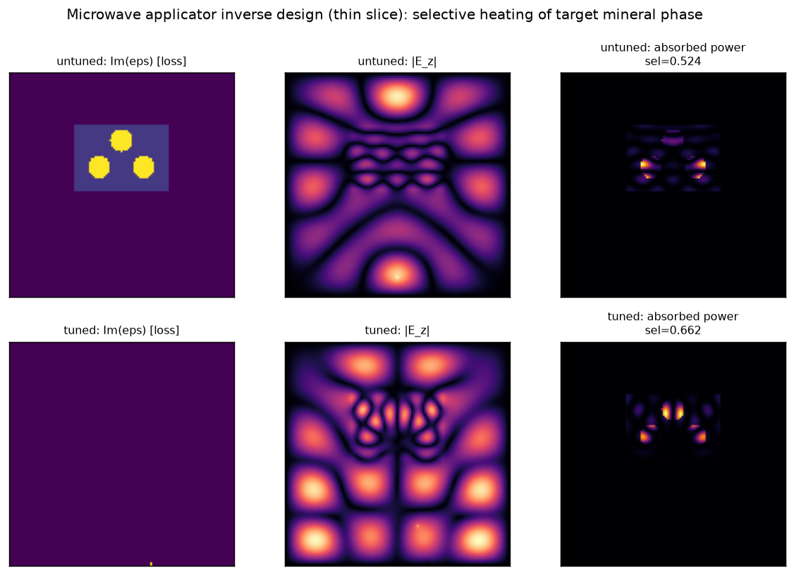
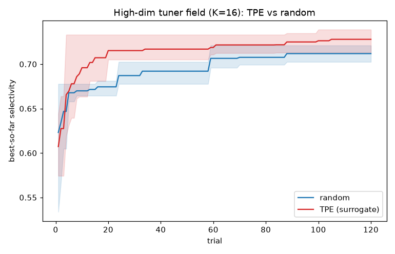
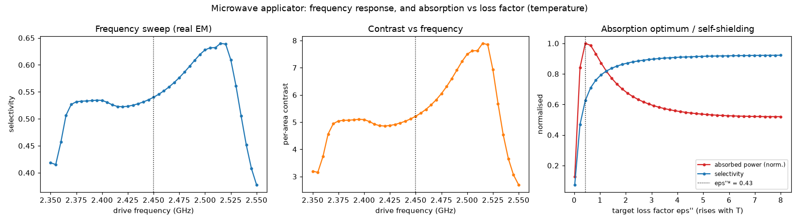
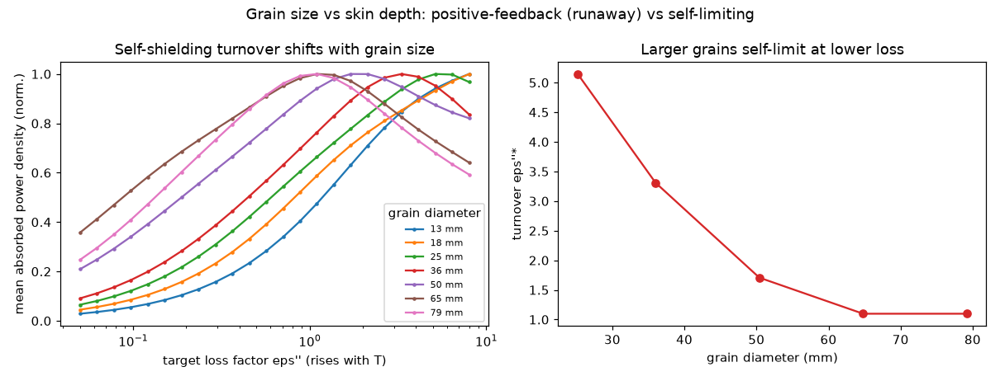

# Microwave Applicator Inverse Design — Selective Mineral Heating (thin slice)

**Does applicator geometry move selective-absorption contrast between mineral phases?**
A minimal, self-contained experiment that says *yes*, built to de-risk a larger idea:
porting electromagnetic inverse design from nanophotonics to microwave mineral
processing.

| | |
|---|---|
| **Status** | Thin slice / assumption test — **not** a microwave-heating product |
| **Runs on** | numpy + scipy + optuna (no MEEP, no conda) — `python scripts/run_search.py` |
| **Sibling project** | [`nanophotonics-inverse-design`](https://github.com/pberlizov/nanophotonics-inverse-design) — reuses its search→evaluate→keep-best pattern |
| **Frontier survey** | [docs/FRONTIER.md](docs/FRONTIER.md) |

---

## The one assumption this tests

The pitch is: the same machinery you built for routing light through silicon
(FDTD + surrogate-guided geometry search) applies to designing a **microwave applicator
that couples energy selectively into a target mineral phase** while leaving gangue
(waste rock) cool. Everything downstream — 3D, EM-thermal coupling, fluidized beds,
grant narratives — rests on one prior question:

> **Can geometry alone produce useful selective-absorption contrast at all?**

This repo answers it with a running experiment instead of an analogy.

## Result (reproducible, real mineral data)

Materials are **measured literature permittivities** with citations (see
[docs/MATERIALS.md](docs/MATERIALS.md)), not placeholders. The answer depends on the
mineral regime — which is itself the finding.

`python scripts/run_search.py --trials 80 --materials <pair>` (≈6 s, CPU):

| Mineral pair (cited) | Regime | Untuned selectivity | Optimized (TPE) | Contrast |
|---|---|---|---|---|
| `magnetite_in_quartz` | good absorber in transparent gangue | 0.996 | 0.998 | 996 → 2690 |
| **`pyrite_in_calcite`** | **disseminated absorber, matched ε′** | **0.54** | **0.67** | **5.2 → 9.1** |

**The interesting case is `pyrite_in_calcite`** — Salsman's (1996) thermally-assisted-
liberation system, where pyrite (8 − j0.3) sits in calcite (8.5 − j0.05) with *nearly
equal real permittivity*. The field doesn't preferentially concentrate in the absorber,
so untuned selectivity is barely above 50/50. Optimizing feed position, drive frequency,
and an internal tuning baffle lifts it to **0.67** and nearly doubles per-area contrast.

That regime is **Kingman's documented worst case** for conventional microwave treatment
(finely disseminated absorber in a dielectrically similar gangue). So the headline is
sharper than "geometry matters":

> **Inverse design recovers selectivity precisely in the ore class where material
> contrast alone fails — the class conventional microwave processing handles worst.**

By contrast, when the absorber sits in transparent gangue (`magnetite_in_quartz`),
selectivity is ~0.996 *before any tuning*: material contrast already does the work and
geometry adds little. Honest scope, not a universal win.

**Note on the optimizer:** with only these 6 named knobs, random search ties TPE — the
problem is too low-dimensional to separate them. That changes once the actuator is
high-dimensional (next section).



## High-dimensional optimization: where the surrogate earns its keep

`python scripts/run_field_search.py --materials pyrite_in_calcite --trials 120 --k 16`
(≈30 s) → `data/field_search.json`. Replacing the 6 named knobs with a **reconfigurable
dielectric tuner** — a row of K=16 lossless cells near the top wall, each a continuous
permittivity knob the optimizer shapes to steer the cavity mode — gives a 16-dimensional
problem. Here the surrogate (TPE) **separates cleanly from random**, averaged over 3 seeds:

| Sampler | Best selectivity (mean of 3 seeds) |
|---|---|
| Random | 0.712 |
| **TPE (multivariate)** | **0.728** |

The gap (+0.016) is modest, but the efficiency gap is not: **TPE reaches random's final
quality in ~17% of the budget** (≈20 of 120 trials). And the tuner itself is a better
actuator than the hand-parametrized geometry — it lifts `pyrite_in_calcite` selectivity
to ~0.73 vs 0.67 for the 6-knob search and 0.54 untuned.



This is the honest version of the "BO earns its keep" claim inherited from the
[nanophotonics sibling](https://github.com/pberlizov/nanophotonics-inverse-design):
surrogate optimization pays off when the design space is high-dimensional with
interacting knobs, not on a handful of well-separated ones.

## Frequency and temperature sweeps

`python scripts/run_sweeps.py --materials pyrite_in_calcite` (≈10 s) →
`data/sweeps_summary.json`. Two further, mostly **real-EM** findings:

**1. Frequency is a free knob.** Sweeping the drive across ±4% of the ISM band, selectivity
on `pyrite_in_calcite` moves from **0.38 to 0.64** (best at 2.515 GHz, vs 0.54 at 2.45 GHz)
— comparable to what the whole geometry optimizer buys, just by retuning the magnetron.

**2. "More loss" is not "more heat" — absorption is self-limiting.** Sweeping the target's
loss factor ε″ (which rises with temperature), absorbed power is **non-monotonic**: it
peaks at an impedance/skin-depth-matched optimum **ε″\* ≈ 0.43** and then *falls* as the
grain expels the field (self-shielding). Disseminated pyrite (ε″ = 0.3) already sits just
below that optimum. Consequently the lumped thermal model (parametric Arrhenius ε″(T),
anchored to Cumbane 2008's measured strong T-dependence of pyrite) gives **smooth,
self-limiting heating — not unbounded thermal runaway** — for grains larger than the skin
depth. (Selectivity, separately, keeps rising with ε″.) True runaway needs grains ≪ skin
depth so absorption keeps climbing with ε″; this slice flags that regime rather than
modelling it. Details and citations: [docs/MATERIALS.md](docs/MATERIALS.md).



## Grain size vs skin depth — what sets the runaway boundary

`python scripts/run_grain_sweep.py --materials pyrite_in_calcite` (≈50 s) →
`data/grain_sweep.json`. This closes the question the self-limiting result raised: *which
grains run away and which self-limit?* The answer is a single length-scale comparison.

The microwave **skin (power-penetration) depth** in pyrite at 2.45 GHz runs from ~184 mm
(ε″=0.3) down to **~7.6 mm at loss tangent 1**. Sweeping ε″ at fixed grain size traverses
the grain/skin-depth ratio, and the absorption turnover lands right at **grain diameter ≈
skin depth** — measured, the turnover collapses onto **d/δ = 1.8 ± 0.4** across grain
sizes:

| Grain diameter | Turnover ε″\* | Skin depth there | d/δ | Regime |
|---|---|---|---|---|
| 13 mm | none in range | 7.6 mm | 1.7 | **runaway-prone** (absorption rises throughout) |
| 18 mm | none in range | 7.6 mm | 2.4 | **runaway-prone** |
| 25 mm | 5.1 | 11 mm | 2.3 | self-limiting |
| 36 mm | 3.3 | 17 mm | 2.1 | self-limiting |
| 50 mm | 1.7 | 32 mm | 1.6 | self-limiting |
| 65 mm | 1.1 | 50 mm | 1.3 | self-limiting |

> **Large grains self-limit; grains at or below the skin depth (~mm — i.e. real
> disseminated grains) stay on the positive-feedback side through the whole physical loss
> range, so they are runaway-prone.**

That is precisely why finely disseminated sulphides are the canonical thermally-assisted-
liberation target — they sit on the runaway-prone side of the grain-size/skin-depth
boundary, and it falls straight out of the forward model. (2D disks vs a 1D plane-wave
skin depth, plus grid discreteness, put the collapse near d/δ≈1.8 rather than exactly 1.)



## What the physics actually is

- **Forward model** ([src/mw_inv/fdfd.py](src/mw_inv/fdfd.py)): 2D frequency-domain FDFD
  Helmholtz solver for the out-of-plane field `E_z` in a PEC-walled metal cavity, with
  complex permittivity `eps' + i·eps''`. Single sparse solve per design.
- **Physics swap vs. photonics:** the lossless dielectric `eps` of the splitter becomes
  a **lossy** `eps'' > 0`, and the flux-split FOM becomes **absorbed power density**
  `p = ½·ω·eps0·eps''·|E|²`. This is the term that does *not* exist in the nanophotonics
  forward model — it is the substance of the port, not a parameter tweak.
- **FOM** ([src/mw_inv/fom.py](src/mw_inv/fom.py)): *selectivity* = fraction of charge
  absorption landing in the target phase; plus per-area *contrast* (target vs gangue).
- **Materials** ([src/mw_inv/materials.py](src/mw_inv/materials.py)): cited complex
  permittivities for magnetite, pyrite, quartz, calcite, packaged as two `MaterialPair`s.
- **Geometry** ([src/mw_inv/geometry.py](src/mw_inv/geometry.py)): a metal cavity, a feed
  stub, an ore charge (gangue rectangle with disseminated target inclusions), an optional
  internal PEC baffle, and a reconfigurable **dielectric tuner field** (the high-dim knob
  set). The relaxed field-uniformity argument means we optimize *selectivity*, not volume
  uniformity.
- **Search** ([src/mw_inv/search.py](src/mw_inv/search.py)): Optuna TPE + a random-search
  control. Low-dim named knobs (`*_search`) and a high-dim tuner field (`*_field_search`).

## Quick start

```bash
cd ~/microwave-inverse-design
python3 -m pip install -r requirements.txt        # numpy scipy optuna (+ matplotlib>=3.11)
python3 scripts/run_demo.py --materials pyrite_in_calcite     # one forward solve + FOM
python3 scripts/run_search.py --trials 80 --materials pyrite_in_calcite   # 6-knob: random ties TPE
python3 scripts/run_field_search.py --materials pyrite_in_calcite --k 16  # 16-dim: TPE beats random
python3 scripts/run_sweeps.py --materials pyrite_in_calcite   # freq + loss/thermal sweeps
python3 scripts/run_grain_sweep.py --materials pyrite_in_calcite  # grain-size/skin-depth crossover
python3 scripts/plot_fields.py --materials pyrite_in_calcite  # -> data/fields.npz (+ fields.png)
python3 -m pytest tests/ -q                         # 14 sanity checks
```

> **Figures:** committed plots live in [docs/img/](docs/img/). To regenerate them you need
> `matplotlib >= 3.11` (earlier versions hit a `savefig` RecursionError on CPython 3.14);
> all scripts still emit their `.json`/`.npz` data if matplotlib is absent or too old.

## Limitations (what this is NOT)

This is a thin slice. Do **not** read quantitative engineering claims into it.

- **2D, single-frequency, steady-state.** No 3D, no broadband, no transient.
- **Only a lumped thermal model.** `run_sweeps.py` adds a 0-D energy balance with a
  parametric ε″(T) ramp (self-limiting heating result), but the field FOM itself is still
  absorbed EM power density — no *spatial* heat diffusion, no coupled EM-thermal time
  stepping, no fracture mechanics. ε″(T) is parametric, not a measured curve.
- **No fluidized bed / discrete conductive particles.** The charge is a static
  two-phase dielectric, not a moving bed of conductive grains.
- **Real but uncertain dielectric values.** Permittivities are cited literature values
  ([docs/MATERIALS.md](docs/MATERIALS.md)), but mineral permittivity varies with grain
  size, form, porosity and temperature — representative, not exact for a given ore.
  **Temperature dependence and magnetite's magnetic loss are not modelled.**
- **FDFD, not FDTD.** Chosen so the slice runs with no MEEP/conda. The production
  engine is openEMS / MEEP / FDTDX (see [docs/FRONTIER.md](docs/FRONTIER.md)).
- **The market/policy thesis is unverified here.** Claims about executive orders,
  NDAA/DoD/DOE programs, and the Salakhi/Thomson 2025 fluidized-bed result are *not*
  validated by this code; they motivate the direction, they are not evidence.

## Relationship to the nanophotonics project

| Layer | Ported? |
|---|---|
| Search → evaluate → keep-best loop, random-baseline discipline | **Reused** (the transferable asset) |
| Forward model | **Rewritten** — added a loss channel + absorbed-power FOM |
| Geometry generator | **Replaced** — the pretrained EBL/DRC manifold has no microwave analogue; hand-parametrized cavity instead |

The thing that made the photonics repo novel (a learned DRC-compliant generative
manifold) is exactly the thing that does *not* transfer. The thing that transfers is the
*methodology*. This repo is the evidence for that distinction.
